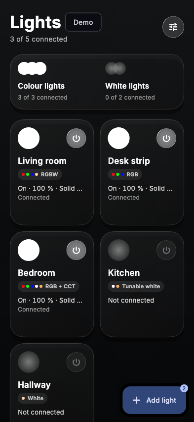
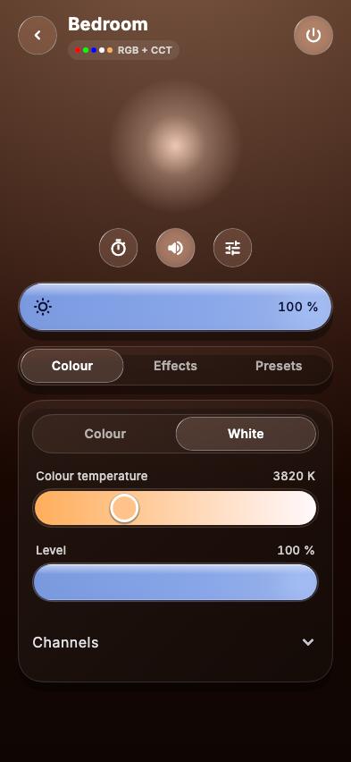

# ElectroBright

ElectroBright is a Bluetooth lighting system with three parts:
- **Hardware:** an ESP32-C3 on a small MOSFET board drives a 12 V / 24 V LED strip ([wiring guide](docs/wiring_guide.md)).
- **Firmware:** one universal image (3.8.2) for all five fixture types (RGBW, RGB, RGBCCT, CCT and W). The light stores its type, and lights update wirelessly from the app ([firmware](firmware/README.md)).
- **App:** a Flutter app for iOS and Android that talks to the lights directly over Bluetooth, with no server or cloud ([app guide](docs/app.md)).

<p>
  
  
</p>

*Screenshots are the app's golden test images (`app/test/goldens/`), rendered from demo lights.*

## Repository layout

```
ElectroBright/
├── app/        Flutter app (iOS, Android): lib/, test/, integration_test/, tool/ (check, bundle firmware)
├── firmware/   ESP32-C3 firmware
│   ├── core/ElectroBrightCore/   shared core library (all fixture types)
│   ├── fixtures/                 one sketch per default type
│   ├── update/                   the type-neutral wireless-update image
│   ├── test/                     host tests, simulator (fwsim), golden baseline
│   └── tools/                    build, flash, update-image, IDE setup, conformance
├── docs/       all documentation (index: docs/README.md)
└── CHANGELOG.md
```

## Quick start

**Try the app without hardware (demo mode):**
```bash
cd app
flutter run          # on a simulator or phone, choose "Try demo lights"
```

**Build and flash a light** (macOS/Linux, with the Arduino IDE installed; see [docs/firmware.md](docs/firmware.md) for the IDE route and exact settings):
```bash
firmware/tools/install_ide_core.sh   # once: makes the shared core visible to the IDE
firmware/tools/flash.sh RGB          # build the RGB sketch, flash the connected board, print its version
```
After that, the app adds the light and keeps its firmware up to date wirelessly.

**Run the tests:** `app/tool/check.sh` (details in [docs/testing.md](docs/testing.md)).

## Documentation

- [docs/README.md](docs/README.md): index of every document, reading order and glossary
- [docs/user_guide.md](docs/user_guide.md): for people using the lights
- [CHANGELOG.md](CHANGELOG.md): app and firmware history
