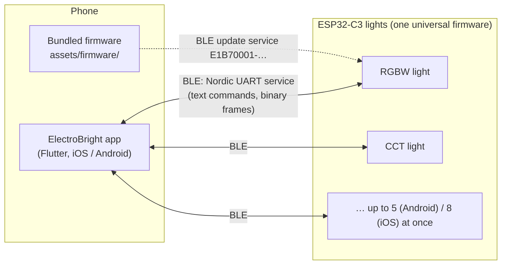
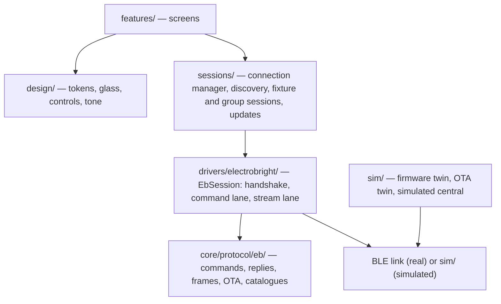
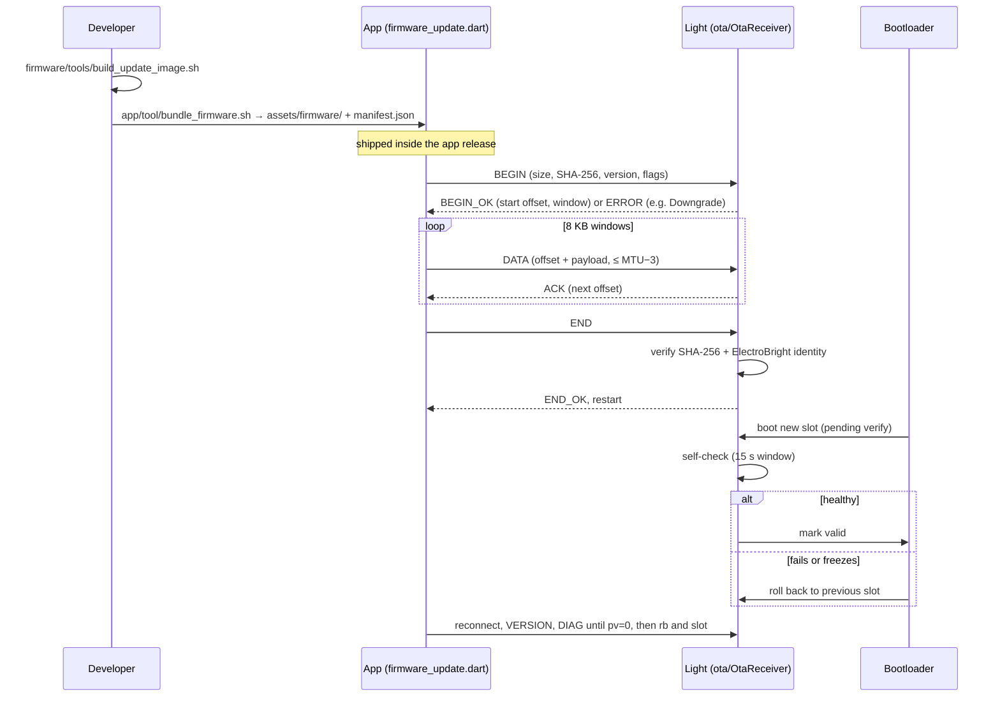

# Architecture

How ElectroBright fits together. Why it is built this way is in [design_decisions.md](design_decisions.md); the wire format is in [protocol.md](protocol.md).

## 1. The system

- There is no server or cloud. The phone talks to each light directly over Bluetooth Low Energy.
- A light accepts one phone at a time. While connected, the app is the light's only writer (see [design_decisions.md](design_decisions.md#bluetooth-only-the-app-is-the-only-writer)).
- Every light runs the same firmware image; the fixture type (RGBW, RGB, RGBCCT, CCT, W) is stored in the light. See [firmware.md](firmware.md).

## 2. App layers (`app/lib`)

| Layer | Folder | Role |
|---|---|---|
| UI | `features/` | Onboarding, Home, add light, control, groups, light settings, developer, firmware update, diagnostics |
| Design system | `design/` | Tokens, theme, glass surfaces, controls, haptics, refresh governor (`design/platform/refresh_governor.dart`) |
| Sessions | `sessions/` | `connection_manager.dart`, `discovery.dart`, `fixture_session.dart`, `group_session.dart`, `group_presets.dart`, `firmware_update.dart`, `rituals.dart` (identify, channel test) |
| Drivers | `drivers/electrobright/` | `eb_session.dart` (per-link state machine), `command_lane.dart` (one reply-bearing text command in flight), `stream_lane.dart` (paced binary colour/brightness frames, newest wins) |
| Protocol | `core/protocol/eb/` | Encoders/parsers for the text protocol, binary frames, scenes, OTA packets; the fixture and mode catalogues |
| Simulator | `sim/` | `eb_device_model.dart` (firmware twin), `ota_twin.dart`, `sim_central.dart`: demo lights and tests |
| Wiring | `bootstrap/service_registry.dart` | Builds the services for real or demo mode |

Model and colour code sit in `core/model`, `core/color` and `core/store`. The feature-by-feature guide is [app.md](app.md).

## 3. Firmware layers (`firmware/core/ElectroBrightCore/src`)

| Layer | Folder | Role |
|---|---|---|
| Platform | `platform/` | ESP32 glue: `App.cpp` (start-up, watchdog, loop), `BleNus` (GATT), `PwmOutput`/`PwmPlan.h` (LEDC), `NvsStore`, `Buzzer`, `EspOtaFlash` |
| Protocol | `protocol/` | `LineAssembler`, `CommandParser`, `BinaryFrame`, `Replies`, `Egress` |
| Control | `control/ControllerCore.cpp` | Applies commands to state; identify, probe, timer, presets |
| Render | `render/` | `RenderEngine` at 200 Hz (`kRenderPeriodUs = 5000`), effects in `render/effects/`, `ChannelMap.h`, gamma LUT |
| State | `state/` | `DeviceState`, `StateStore` (NVS), `SceneCodec` (preset records) |
| Fixture | `fixture/` | `Profiles.h` (every type on one board pinout), `FixtureSelect` (stored type) |
| Update | `ota/` | `OtaReceiver`, `Sha256`, `ImageIdentity`, `SelfCheck` |

Only `platform/` touches ESP-IDF/Arduino; everything else builds on the host for `make -C firmware/test` and the `fwsim` simulator (see [testing.md](testing.md)).

## 4. Connection manager

`app/lib/sessions/connection_manager.dart` decides which lights are connected. Callers hold a *want* with a reason (`update`, `setup`, `screen`, `action`, `group`, `scene`, `favourite`, highest first).

| Limit (`ConnectionPolicy`) | Value |
|---|---|
| Links open at once | 5 on Android, 8 on iOS (`maxConnections`). When all are in use, a higher-priority want disconnects the least recently used light whose wants are all lower **and** whose session is idle (nothing in flight); if there is none, the new want waits ("deferred") until a link closes. A busy lower-priority light is never cut off. |
| Connect timeout | 10 s |
| Idle grace (unwanted, foreground) | 60 s |
| Background grace | 20 s, then every light is released so other phones can use it |
| Android advert freshness | only lights heard in the last 10 s (except on a direct user action) |
| Reconnect backoff | 0.5, 1, 2, 4, 8, 16, 30 s; "Unavailable" after 3 failures (retries continue) |
| Offline changes | wait 60 s (`FixtureSession.offlineWindow`), in memory only |

iOS favourites use an open-ended connect that waits for the light to appear. Discovery (`discovery.dart`) runs a low-power scan filtered to the ElectroBright service while Home is visible, and a fast unfiltered scan only on the add screen.

## 5. Groups

Two automatic groups by LED kind (`sessions/group_session.dart`): **Colour lights** (RGB, RGBW, RGBCCT) and **White lights** (CCT, W). One group screen is open at a time. It connects its lights favourites first, within the connection budget, and broadcasts the same commands to every light that follows it; each light still runs its own effect clock. Group presets (`group_presets.dart`) live on the phone. Behaviour in detail: [app.md §3](app.md#3-groups).

## 6. Update pipeline

- **Build:** `firmware/update/ElectroBright_Update` is the type-neutral image; `firmware/tools/build_update_image.sh` builds it and `app/tool/bundle_firmware.sh` copies it with a manifest into `app/assets/firmware/`. See [firmware.md](firmware.md) and [release.md](release.md).
- **Transfer:** separate GATT service (`ota/OtaProtocol.h`): an ACK at least every 8192 bytes, a 15 s data timeout, resume from the offset the light reports. Protocol: [protocol.md §10](protocol.md).
- **Protection:** no downgrades (`ERROR Downgrade`), the same version only with the reinstall flag, SHA-256 and identity check before the slot switch, and bootloader rollback (`CONFIG_BOOTLOADER_APP_ROLLBACK_ENABLE`). The identity block is not a signature; see [security.md](security.md).
- **In the app:** a light is offered an update if its link exposes the update service and its version is older than the bundle. While it updates, its command lanes pause and groups skip it; only one light updates at a time.
