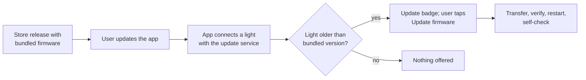

# Release procedure

How to cut an app release. The firmware ships **inside** the app, so an app release is also how new firmware reaches lights (there is no update server). Building and flashing firmware by hand is in [firmware.md](firmware.md); the test suites are in [testing.md](testing.md).

Current versions: app `2.0.0+200` (`app/pubspec.yaml`), firmware `3.8.2` (`kFirmwareVersion` in `firmware/core/ElectroBrightCore/src/config/Config.h`).

## 1. Bump the versions

| What | Where | Rule |
|---|---|---|
| Firmware (only if it changed) | `kFirmwareVersion` in `Config.h` | Always increase: lights refuse an older image (`Downgrade`) and the same version without the reinstall flag (`SameVersion`). Record user-visible changes in the golden changelog comment at the top of `firmware/test/golden/Scenarios.cpp` and re-record the golden (`make -C firmware/test golden-record`) only for intended changes. |
| App | `version:` in `app/pubspec.yaml` (`name+build`) | The build number (`+200`) becomes the iOS build number and the Android `versionCode`; it must increase with every store upload. |
| Changelog | [CHANGELOG.md](../CHANGELOG.md) | Plain-words entry for both. |

## 2. Bundle the firmware

```bash
app/tool/bundle_firmware.sh
```

It runs `firmware/tools/build_update_image.sh` three times (the release image and the two `--rollback-test fail|freeze` images) and writes:

- `app/assets/firmware/ElectroBright_Update-<version>.bin` and `manifest.json` (product, kind, version, size, SHA-256, file);
- `app/lib/features/developer/rollback_test_images.g.dart` (debug builds only reach it).

`test/cross_repo/firmware_bundle_test.dart` fails if the manifest doesn't match the file or `kFirmwareVersion`, so a forgotten re-bundle is caught by step 3.

**Release rule: update to it, then update from it.** Every bundled firmware must pass, on real hardware, before the release:

1. a wireless update **to** it from the previous released firmware (the light comes back on the new version, confirmed, `rb` unchanged), and then
2. a wireless update **from** it: Reinstall of the same image on the light now running it (Developer page), which must complete and confirm.

A firmware whose update path is broken would otherwise confirm itself and strand every light that installs it: downgrades are refused, so only USB could recover them. Record both runs (light type, versions, date) with the release.

## 3. Verify

```bash
app/tool/check.sh --builds
```

Format, analyze, firmware host tests, all `flutter test` suites, then an iOS simulator debug build, a signed Android release APK, and `tool/check_release_excludes_tests.sh`, which confirms the release binary contains neither the rollback test images nor the option. Then run the hardware checklists in [testing.md](testing.md) on real lights, including an over-the-air update from the previous release.

## 4. Release builds

**Android.** Release signing reads `app/android/key.properties` (git-ignored: `storeFile`, `storePassword`, `keyAlias`, `keyPassword`). Without it a release build **fails** with a message saying so: signed with any other key, it could never upgrade the installed app. For a test build that is never published, `flutter build apk --release --android-project-arg=allowDebugSigning=true` signs with the local debug key. The application id is `com.electrobright.electrobright_app` (kept from the previous app so v2 installs as an upgrade).

```bash
cd app
flutter build appbundle --release      # Play Store upload (.aab)
```

**iOS.** Bundle id `com.electrobright.electrobrightApp`, signing team set in the Xcode project.

```bash
cd app
flutter build ipa --release            # then upload with Xcode Organizer or Transporter
```

## 5. Tag

A release is tagged `v<major>.<minor>`, its candidates `v<major>.<minor>-rc<n>`; the review candidate was `v1.0-rc1`, so the first store release is `v1.0`. The release number is the product's and independent of the app version (`2.0.0+200`) and the firmware version (`3.8.2`); the tag message records both:

```bash
git tag -a v1.0-rc2 -m "Release candidate 2: app 2.0.0+200, firmware 3.8.2"
git tag -a v1.0 -m "Release 1.0: app 2.0.0+200, firmware 3.8.2"
```

`fw-<version>` tags (`fw-3.4.0-golden`, `fw-3.6.0`) mark firmware milestones between releases; `old-app-final` marks the removal of the previous app. The repository has no remote yet.

## 6. Store submission checklist

- [ ] **Developer accounts:** Apple Developer Program and Google Play Console, both active.
- [ ] **Bluetooth permission texts:**
  - iOS: `NSBluetoothAlwaysUsageDescription` = "ElectroBright uses Bluetooth to find and control your lights." (`app/ios/Runner/Info.plist`).
  - Android: `BLUETOOTH_SCAN`, `BLUETOOTH_CONNECT`; location only up to API 30 (`app/android/app/src/main/AndroidManifest.xml`). Play's permissions declaration: Bluetooth is used only to find and control the user's lights; no location is derived.
- [ ] **Privacy answers:** the app has no server, account, analytics or network code; it stores light names, presets and settings only on the phone. App Store privacy label "Data Not Collected"; Play Data safety "No data collected or shared". Re-check if any SDK is added.
- [ ] **Privacy manifest (iOS):** `app/ios/Runner/PrivacyInfo.xcprivacy` declares no tracking, no collected data, and the app's own required-reason APIs: file timestamps (`C617.1`, the store checks its own files) and UserDefaults (`CA92.1`, the one-time import of the previous app's settings). Flutter, `shared_preferences_foundation` and SwiftProtobuf ship their own manifests; `flutter_reactive_ble` (reactive_ble_mobile) ships none and uses no required-reason API; `path_provider_foundation` has no native code of its own (FFI). Re-check when a plugin is added or upgraded; Xcode's privacy report (Organizer, archive, *Generate Privacy Report*) lists them all.
- [ ] **Export compliance:** `ITSAppUsesNonExemptEncryption` is `false` in `Info.plist`: the app uses no encryption of its own (Bluetooth link encryption is the OS's).
- [ ] **Icons:** `app/ios/Runner/Assets.xcassets/AppIcon.appiconset` (1024 px included) and the Android launcher icons.
- [ ] **Screenshots:** phone sizes each store requires; demo lights ("Try demo lights") show every light type without hardware.
- [ ] **Review notes:** reviewers have no ElectroBright hardware; tell them to use **Try demo lights** on the welcome screen.

## 7. How updates reach lights



Nothing is pushed: a light updates only when a phone with the newer app connects and the user starts the update. Lights on firmware before 3.8.0 have no update service and need one USB install ([firmware.md](firmware.md)). The mechanism itself (slots, verification, rollback) is described in [architecture.md](architecture.md) and [protocol.md](protocol.md) §10.
