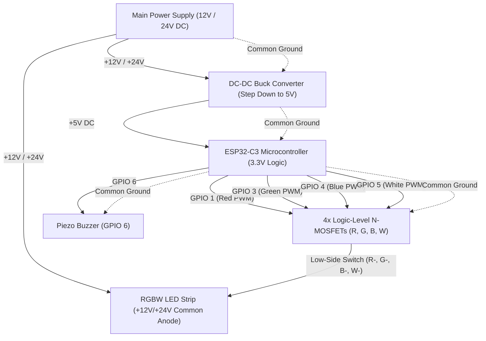

# ElectroBright Hardware & Wiring Guide (ESP32-C3 Edition)

A complete circuit connection, hardware assembly, and migration guide for building the **ElectroBright** 4-channel RGBW smart lighting system powered by the **ESP32-C3** microcontroller with native Bluetooth Low Energy (BLE 5.0).

The firmware for this hardware lives in [`firmware/ElectroBright/`](../firmware/ElectroBright/README.md).

---

## 1. Arduino Nano to ESP32-C3 Migration Map

If you are upgrading an existing build from an **Arduino Nano** (ATmega328P) to the **ESP32-C3**, use this quick wire-transfer table:

| Function | Old Arduino Nano Pin | New ESP32-C3 Pin | Signal / Logic Level | Notes |
| :--- | :--- | :--- | :--- | :--- |
| **Red Channel** | **D3** (PWM) | **GPIO 1** | 3.3V PWM (14-bit, ~4.9 kHz) | Connects to Red MOSFET Gate via 220Ω (Avoids strapping conflict on GPIO 2) |
| **Green Channel** | **D5** (PWM) | **GPIO 3** | 3.3V PWM (14-bit, ~4.9 kHz) | Connects to Green MOSFET Gate via 220Ω |
| **Blue Channel** | **D6** (PWM) | **GPIO 4** | 3.3V PWM (14-bit, ~4.9 kHz) | Connects to Blue MOSFET Gate via 220Ω |
| **White Channel** | **D9** (PWM) | **GPIO 5** | 3.3V PWM (14-bit, ~4.9 kHz) | Connects to White MOSFET Gate via 220Ω |
| **Audio Buzzer** | **D10** | **GPIO 6** | 3.3V Pulse | Positive (+) leg of piezo buzzer |
| **Status LED** | *None* (Old D13) | **GPIO 7 / 8 — not used** | — | The current firmware has no status LED (see 4.3). |
| **Power Input** | **5V / VIN** | **5V / VBUS** | 5V DC (regulated) | From DC-DC Buck Converter or USB |
| **Ground** | **GND** | **GND** | 0V Common | Must connect to all circuit grounds |

> [!TIP]
> **Components to REMOVE (Hardware Simplification):**
> Disconnect and completely discard the external Bluetooth module (**HC-05**, **HC-06**, **JDY-31**, or **HM-10**) and its wires from **D0 (RX)** and **D1 (TX)**. The ESP32-C3 features **native, built-in BLE 5.0**, eliminating the need for external serial wireless modules or voltage divider circuits.

---

## 2. Bill of Materials (BOM)

| Category | Component | Specification | Quantity |
| :--- | :--- | :--- | :--- |
| **Microcontroller** | ESP32-C3 Dev Board | ESP32-C3 SuperMini, Xiao C3, or DevKitM-1 | 1 |
| **Lighting** | RGBW LED Strip | Common-Anode 12V or 24V (e.g., SMD 5050 RGBW / SK6812 RGBW non-addressable) | 1 |
| **Main Power** | DC Power Supply | 12V or 24V (matches strip voltage; sized for strip current: 2A–10A+) | 1 |
| **Logic Power** | DC-DC Buck Converter | LM2596, MP1584, or Mini360 step-down module (12V/24V $\to$ 5V DC) | 1 |
| **Switches** | Logic-Level N-MOSFETs | **IRLZ44N**, **IRLB8721**, **AO3400**, or 4-channel MOSFET driver module | 4 |
| **Gate Resistors** | Metal Film Resistors | **220Ω – 470Ω**, 1/4W (protects MCU GPIO pins from capacitive inrush) | 4 |
| **Pull-down Resistors**| Metal Film Resistors | **10kΩ**, 1/4W (ties MOSFET Gates to GND to prevent boot flicker) | 4 |
| **Audio** | Piezo Buzzer | Passive Piezo Buzzer (enables frequency generation in firmware) | 1 |
| **Buzzer Protection** | Series Resistor | **100Ω**, 1/4W (optional current limiting for buzzer) | 1 |

---

## 3. High-Level System Architecture



---

## 4. Detailed Wiring Schematics

### 4.1 Power Distribution & Common Ground

> [!WARNING]
> **COMMON GROUND IS CRITICAL:** The negative output of the 12V/24V power supply, the output ground of the DC-DC buck converter, the Source pins of all 4 MOSFETs, and the ESP32-C3 `GND` pin **must all be tied together**. Missing a common ground is the leading cause of random flashing, unresponsive LEDs, and electrical damage.

1. **LED Strip Power:** Connect the Power Supply Positive (+) directly to the `+12V` (or `+24V`) terminal of the RGBW LED strip.
2. **Buck Converter Input:** Connect Power Supply Positive (+) to Buck `IN+`, and Power Supply Negative (-) to Buck `IN-`.
3. **Step Down Adjustment:** Before connecting the ESP32-C3, measure the buck converter output with a multimeter and adjust the trimmer potentiometer until `OUT+` reads exactly **5.0V DC**.
4. **ESP32-C3 Power:** Connect Buck `OUT+` to the ESP32-C3 **5V / VBUS / VIN** pin, and Buck `OUT-` to the ESP32-C3 **GND** pin.

---

### 4.2 MOSFET Drive Circuit (Per Channel: R, G, B, W)

Each color channel uses a low-side N-channel MOSFET switch:

```
                  +12V / +24V Main Power
                            │
                            ▼
                    ┌───────────────┐
                    │ RGBW Strip +  │
                    │               │
                    │ Color Pin (R-)│
                    └───────┬───────┘
                            │ Drain (D / Pin 2)
                        ┌───┴───┐
      ESP32-C3          │       │ Logic-Level N-MOSFET
      GPIO Pin ───[220Ω]┤ Gate  │ (IRLZ44N / AO3400)
    (GPIO 1/3/4/5)      │ (G)   │
                        └───┬───┘
                            │ Source (S / Pin 3)
                            ├─── Common Ground (GND)
                            │
                       [10kΩ Pull-down]
                            │
                           GND
```

* **Gate Resistor (220Ω – 470Ω):** Placed in series between the ESP32-C3 GPIO pin and the MOSFET Gate. Protects the GPIO output driver from high inrush charging current caused by Gate capacitance.
* **Pull-down Resistor (10kΩ):** Connected between MOSFET Gate and Ground. Guarantees the channel remains 100% OFF while the ESP32-C3 boots or is in deep sleep.
* **Drain:** Connected directly to the cathode pad of the strip channel (`R-`, `G-`, `B-`, or `W-`).
* **Source:** Connected directly to the system Common Ground.

---

### 4.3 Status LED (not used)

The current firmware does not drive a status LED; all feedback comes from the buzzer. GPIO 7 and 8 are never configured and stay at their reset state (inputs).

* **New builds:** leave GPIO 7 and 8 unconnected; no LED or resistors are needed.
* **Existing builds** with the old dual-colour LED (anode on 3.3 V, cathodes to GPIO 7 / 8) can leave it in place: it simply stays dark. GPIO 8 is a boot strapping pin; the LED's connection to 3.3 V keeps it high, which is harmless.

---

### 4.4 Piezo Buzzer Connection

```
      ESP32-C3 GPIO 6 ────[100Ω Resistor]────(+) Buzzer Leg
                                                 (-) Buzzer Leg ──── Common Ground (GND)
```

* **GPIO 6:** Connected to Buzzer positive leg (via optional 100Ω resistor for current limit).
* **Ground:** Connected to common GND.
* Non-blocking melodic feedback: boot chime, mode change, preset save / load / delete, timer set / cancel, sleep / wake, errors. It can be muted from the app (the setting is remembered).

---

## 5. Critical Electrical & Engineering Precautions

> [!CAUTION]
> **3.3V Logic Level Requirement:** The ESP32-C3 digital pins operate at **3.3V**, not 5V.
> * Use **True Logic-Level MOSFETs** with Gate-Source Threshold $V_{GS(th)} \le 2.0\text{V}$ (such as **IRLZ44N**, **IRLB8721**, or **AO3400**).
> * Avoid standard MOSFETs like **IRF540N** or **IRFZ44N**; these require 10V at the gate to fully turn on. At 3.3V, they operate in the linear resistance region, overheat rapidly, and may burn out under load.

> [!IMPORTANT]
> **Current & Wire Gauge:** 
> * A 5-meter RGBW strip running at 100% white can draw between **4A to 12A+**.
> * Use appropriately sized stranded wire (minimum **18 AWG** to **16 AWG** for main power and ground leads).
> * High-current traces should not pass through a solderless breadboard. Solder power leads directly to heavy-duty strip terminals or use a dedicated terminal block distribution board.

---

## 6. Pre-Power On Checklist

Before plugging in your main power supply, verify each connection:

- [ ] **External Bluetooth Disconnected:** Old HC-05/JDY module removed; pins D0/D1 wires eliminated.
- [ ] **Buck Converter Calibrated:** Tested with a multimeter; output verified at **5.0V** before connecting to ESP32-C3.
- [ ] **Common Ground Unified:** PSU (-), Buck OUT (-), ESP32 GND, and MOSFET Sources all connected together.
- [ ] **MOSFET Gates Protected:** 220Ω series resistors installed on GPIO 1, 3, 4, 5 with 10kΩ pull-downs to GND.
- [ ] **LED Strip Polarity:** Strip `+12V/+24V` connected to PSU (+); `R, G, B, W` connected to MOSFET Drains.
- [ ] **Buzzer Wiring:** Connected between GPIO 6 and GND.

